# **Google Assistant in DragonBoard 410c communicating with MQTT Server**

    This document provides instructions to integrate Google Assistant in a DragonBoard 410c in order to communicate with an MQTT Server.

## **Google Assistant SDK for Devices**

### **Google Assistant Service**

    The Google Assistant Service gives you full control over the integration with the Assistant by providing a streaming endpoint. Stream a user audio query to this endpoint to receive a Google Assistant audio response.

1. **Basic Hardware Requirements**
    - DragonBoard 410c;
    - Microphone;
    - Speaker;
    - Network access.

2. **Configure an Actions Console Project**

       A Google Cloud Platform project, managed by the Actions Console, gives your device access to the Google Assistant API. The project tracks quota usage and gives you valuable metrics for the requests made from your device.

    - Open the [**Actions Console**][1];
    - Click on **Add/import project**;
    - To create a new project, type a name in the **Project** name box, choose a language and a country/region for your Actions project and click **CREATE PROJECT**. If you already have an existing Google Cloud Platform project, you can select that project and import it instead;
    - If you created a new project, click the **Device Registration** box near the bottom of the page. If you imported a previously-created project, this box will not be displayed; select the **Device Registration** tab (under **ADVANCED OPTIONS**) from the left navbar. Do not close this tab, it will be used to register a device model in a later step;
    - Enable the **Google Assistant API** on the project you selected. You need to do this in the [**Cloud Platform Console**][2];
    - You must configure the [**OAuth Consent Screen**][3] for your project in the **Cloud Platform Console**. Note that most fields on this page are optional.

3. **Set activity controls for your account**

       In order to use the Google Assistant, you must share certain activity data with Google. The Google Assistant needs this data to function properly; this is not specific to the SDK.

    - Open the [**Activity Controls**][4] page for the Google account that you want to use with the Assistant. You can use any Google account, it does not need to be your developer account;
    - Ensure the following toggle switches are enabled (blue):
        - **Web & App Activity**. In addition, be sure to select the Include Chrome history and activity from sites, apps, and devices that use Google services checkbox;
        - **Device Information**;
        - **Voice & Audio Activity**.

4. **Register the Device Model**

       In order for the Google Assistant to respond to commands appropriate to your device and the given context, the Assistant needs information about your particular device. You provide this information, which includes fields like device type and manufacturer, as a device model. You can think of this model as a general class of device - like a light, speaker, or toy robot.

       This information is then accessible to the Google Assistant and is associated with your Actions Console project. No other projects have access to your model and device information.

    - Use the **Registration UI** in the [**Actions Console**][1] to register a device model;<details><summary>Advanced Options Image</summary><p>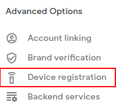</p></details>
    - Click the **REGISTER MODEL** button;
    - Fill out all of the fields for your device. See the [**Device Model JSON Reference**][5] for more information on these fields;
    - When you are finished, click **REGISTER MODEL**;
    - Download the **OAuth 2.0 Credentials** and click **NEXT** when you are done.
    <span style="color:red"> **DO NOT RENAME THIS FILE!**</span>
    - On **Specify Traits**, click **SKIP** for now. Later, you will specify the different abilities that your device supports on this screen;
    - If you need to edit the model, click its row in the list. Make sure to click **SAVE** after any edits.<details><summary>Model List Image</summary><p>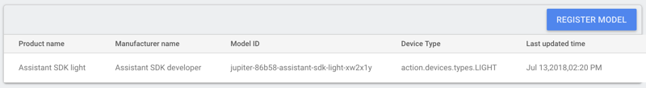</p></details>
    - If you need to download the credentials file again, click the ellipses. You can delete the model from this menu as well.<details><summary>Edit Model and Download Credentials Image</summary><p>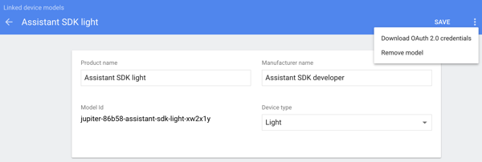</p></details>

5. **Install the SDK and Sample Code**

       Follow these instructions to install the SDK and sample code on your device. Run all of the commands on this topic in a terminal on the device (either directly or via an SSH connection).

       These instructions assume a Python environment running on a Linux platform.

    - **Configure the Environment**

          Use a Python virtual environment to isolate the SDK and its dependencies from the system Python packages.

        **(Recommended) For Python 3:**
        ```sh
        $ sudo apt-get update
        $ sudo apt-get install python3-dev python3-venv
        $ python3 -m venv env
        $ env/bin/python -m pip install --upgrade pip setuptools wheel
        $ source env/bin/activate
        ```

        **For Python 2.7:**
        ```sh
        $ sudo apt-get update
        $ sudo apt-get install python-dev python-virtualenv
        $ virtualenv env --no-site-packages
        $ env/bin/python -m pip install --upgrade pip setuptools wheel
        $ source env/bin/activate
        ```
    - **Get the Packages**

          The Google Assistant SDK package contains all the code required to get the Google Assistant running on the device, including the sample code.

        ><span style="color:red"> **THE FOLLOWING COMMANDS SHOULD RUN ON THE PYTHON VIRTUAL ENVIRONMENT ACTIVATED IN THE LAST STEP!**</span>
        - **Install the package's system dependencies:**
            ```sh
            (env) $ sudo apt-get install portaudio19-dev libffi-dev libssl-dev
            ```
        - **Use pip to install the latest version of the Python package in the virtual environment:**
            ```sh
            (env) $ python -m pip install --upgrade google-assistant-sdk[samples]
            ```
    - **Generate Credentials**

        - **Install or update the authorization tool:**
            ```sh
            (env) $ python -m pip install --upgrade google-auth-oauthlib[tool]
            ```
        - **Generate credentials to be able to run the sample code and tools. Reference the JSON file you downloaded in the Register the Device Model step; you may need to copy it the device. Do not rename this file.**
            ```sh
            (env) $ python -m pip install --upgrade google-auth-oauthlib[tool]
            ```
            You should see a URL displayed in the terminal:
            ```sh
            Please visit this URL to authorize this application: https://...
            ```
        - **Copy the URL and paste it into a browser (this can be done on any machine). The page will ask you to sign in to your Google account. Sign into the Google account that created the developer project in the Configure an Actions Console Project step.**

        - **After you approve the permission request from the API, a code will appear in your browser, such as "4/XXXX". Copy and paste this code into the terminal:**
            ```sh
            Enter the authorization code: YOUR_AUTH_CODE_HERE
            ```
            If authorization was successful, you will see a response similar to the following:
            ```sh
            credentials saved: /path/to/.config/google-oauthlib-tool/credentials.json
            ```
            If instead you see InvalidGrantError, then an invalid code was entered. Try again, taking care to copy and paste the entire code.

6. **Run the Sample Code**

    In the following command:

    ```sh
    (env) $ googlesamples-assistant-pushtotalk --project-id my-dev-project --device-model-id my-model --lang assistant-language
    ```

    - Replace ***my-dev-project*** with the Google Cloud Platform project ID for the [**Actions Console**][1] project you created. To find the project ID in the Actions Console, select the project, click the gear icon, and select **Project settings**. <details><summary>Project settings Image</summary><p>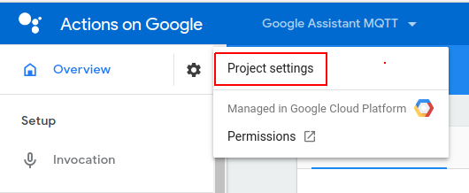</p></details>
    - Replace ***my-model*** with the name of the model you created in the **Register the Device Model** step. <details><summary>Model ID Image</summary><p>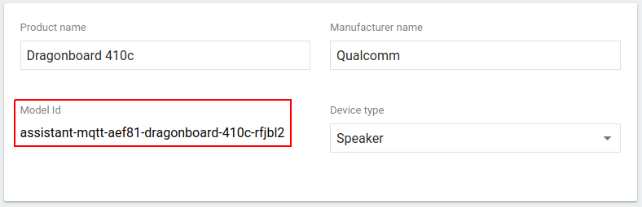</p></details>
    - Replace ***assistant-language*** with the alias of the intended Google Assistant language (e.g.: pt-BR, en-US). Go to the [**Language and Locale Support**][6] to check all supported languages and locales.
    - Run the complete command on the terminal.
    - Press the Enter key and try some of the following queries (considering English as the chosen language):
        - Who am I?
        - What time is it?
        - What is the weather in San Diego?

## **MQTT Server**

### **CloudMQTT**

    CloudMQTT is a great solution for "Internet of Things" messaging between low power sensors or mobile devices such as phones, embedded computers or microcontrollers.

1. **Configure the MQTT Instance**

    - Go to [**CloudMQTT**][7], create a new account or login with an existing one.
    - Click on the **Create New Instance** button.
    - On the **Plan** section, select the **Cute Cat** free plan, give it a name, assign some tags to it and click on the **Select Region** button.
    - On the **Region** section, select a **Data center** and click on the **Review** button. Recommended Data center: US-East-1 (Northern Virginia).
    - On the **Confirm** section, just check all the information provided and click on the **Create instance** button.

2. **Test the created Instance**

    - Install the Mosquitto MQTT Broker using the following commands:
        ```sh
        $ sudo apt-add-repository ppa:mosquitto-dev/mosquitto-ppa
        $ sudo apt-get update
        $ sudo apt-get install mosquitto
        $ sudo apt-get install mosquitto-clients
        ```
    - To **start** the service, use:
        ```sh
        $ sudo service start mosquitto
        ```
    - Create a **Subscriber** completing the command:
        ```sh
        $ mosquitto_sub -h [mqtt_server] -t [your_topic] -u [instance_user] -P [instance_password] -p [instance_port]
        ```
        Go to [**CloudMQTT list of instances**][8] and click on the created instance on the **Configure the MQTT Instance** step to get its details. <details><summary>Instance Details Image</summary><p>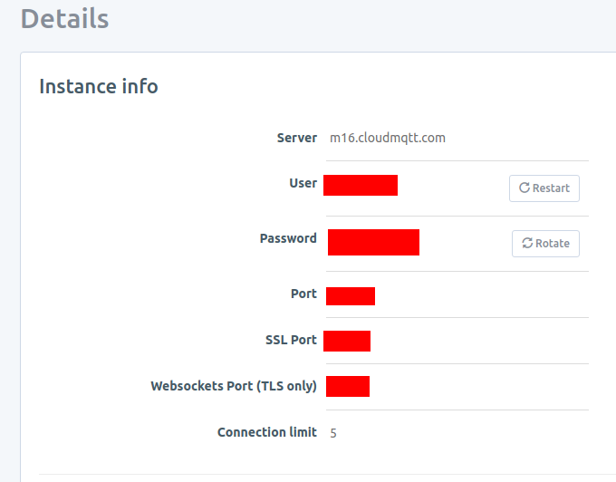</p></details>
        - Replace ***[mqtt_server]*** with the Server information of the instance created on CloudMQTT.
        - Replace ***[your_topic]*** with a string that will represent the subscribed topic.
        - Replace ***[instance_user]*** with the User information of the instance created on CloudMQTT.
        - Replace ***[instance_password]*** with the Password information of the instance created on CloudMQTT.
        - Replace ***[instance_port]*** with the Port information of the instance created on CloudMQTT.
        - Run the complete command.
    
    - Open another Terminal window and **Publish** a message on the subscribed topic completing the command:
        ```sh
        $ mosquitto_pub -h [mqtt_server] -t [your_topic] -u [instance_user] -P [instance_password] -p [instance_port] -m [your_message]
        ```
        - Replace ***[your_message]*** with a message to be published on the subscribed topic.
        - Replace all other parameters with the same values used in the subscribe command.
        - Run the complete command.
        - Check if the Subscriber received the Publisher message.<details><summary>Pub Sub Example Image</summary><p>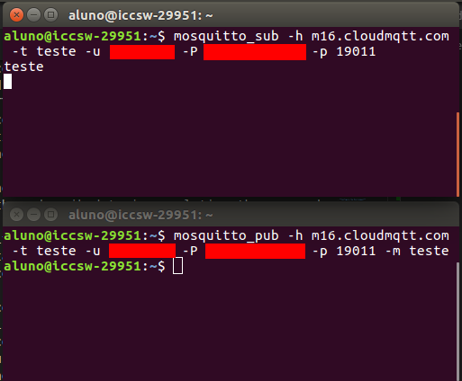</p></details>
    - To **stop** the service, use:
        ```sh
        $ sudo service stop mosquitto
        ```

## **Actions on Google, DialogFlow and Cloud Functions**

### **Configure Your Actions**

Open the [**Actions Console**][1] to start the configuration.

1. **Invocation**

    - In the **Setup** section of the lateral menu, click on the **Invocation** item.
    - Enter a valid **Display name**. This name will be used to interact with your actions.
    - Select a **Google Assistant voice** as you want.

2. **Set Sample Invocations**

    - In the **Deploy** section of the lateral menu, click on the **Directory information** item.
    - In the **Directory information** area, click on the **Sample invocations** section.
    - Add some **invocation phrases** to help Google Assistant invoke your Actions.
    >If you set **"Ok Google, talk to assistant"**, this will be the **EXPLICIT INVOCATION** to use your Actions. But Google Assistant has the **IMPLICIT INVOCATION** feature, that allows you to interact with your actions right from the main assistant. For example, if you have an action called **"turn on lamp"**, you could invoke it implicitly saying **"Ok Google, ask assistant to turn on lamp"**. 

3. **Build an Action**

    - In the lateral menu, click on the **Overview** item.
    - In the **Overview** area, click on the **Build your Action** section and select **Add Action(s)** option.
    - In the **Actions** area, click on the **ADD YOUR FIRST ACTION** button.

### **DialogFlow**

>Some choices made in the following steps should only be considered for this tutorial. You can change any of them according to the needs of your project.

1. **Create your Agent**

    - In the [**DialogFlow**][9] page, choose a **NAME** for your Agent, select the **DEFAULT LANGUAGE**, **DEFAULT TIME ZONE** and make sure that **the created Agent will be linked with your GOOGLE PROJECT**.<details><summary>Agent Creation Image</summary><p>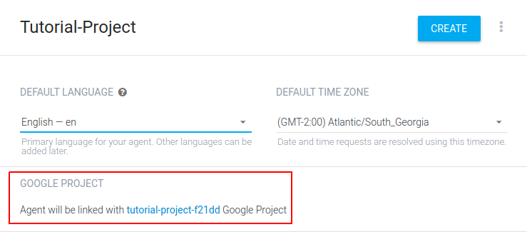</p></details>
    - Click on the **CREATE** button when you are done.

2. **Create a new Intent**

    - In the lateral menu, click on the **Intents** option.
    - Click on the **CREATE INTENT** button.
    - In the **Training Phrases** section, click on the **ADD TRAINING PHRASES** button.
    - Add some **user expressions** in the selected Agent language.<details><summary>Training Phrases Image</summary><p>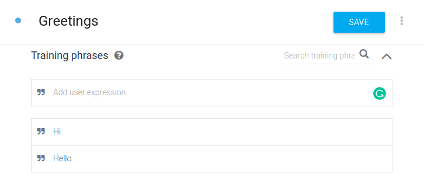</p></details>
    - In the **Responses** section, click on the **ADD RESPONSE** button.
    - Add some **response variants** in the selected Agent language.
    - Make sure that the **Set this intent as end of conversation** switcher is enabled for this example.<details><summary>Intent Responses Image</summary><p>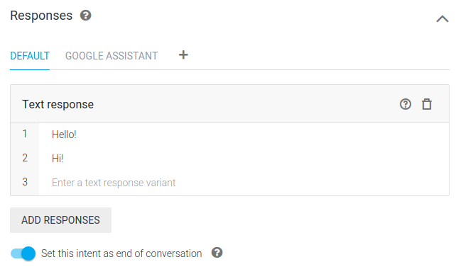</p></details>
    - Click on the **+** button on the right side of the **DEFAULT** option and select **Google Assistant**.
    - On the opened tab, make sure that the **Use response from the DEFAULT tab as the first response** switcher is enabled for this example.<details><summary>Google Assistant Integration Image</summary><p>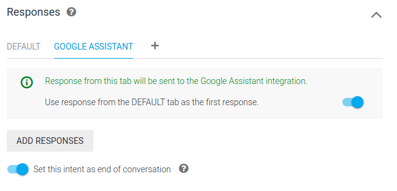</p></details>
    - In the **Fulfillment** section, make sure that **Enable webhook call for this intent** and **Enable webhook call for slot filling** switchers are enabled.<details><summary>Intent Fulfillment Image</summary><p>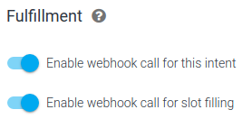</p></details>
    - Click on the **SAVE** button.

3. **Make your Intent available on Google Assistant**

    - In the lateral menu, click on the **Integrations** option.
    - In the **Integrations** area, click on the **Google Assistant** card.
    - In the opened settings, in the **Implicit Invocation** item, type the name of the created intent in the **Add intent** field.
    - Close the settings window clicking on the **CLOSE** button.

4. **Test the created Intent**

    - **On DialogFlow:**

        - **Type** or **Say** one of the **Training Phrases** of the created intent in the **Try it now** console on the top right corner of [**DialogFlow**][10] page.
        - Check if the **DEFAULT RESPONSE** was given properly.

    - **On Actions Console Simulator**

        - Open the [**Actions Console**][1].
        - In the **Test** section of the lateral menu, click on the **Simulator** item.
        - Change the **Surface**, **Language** and **Location** of your Assistant as you want.
        - In the **Input** area, invoke your intent implicitly (check the **note** in the **"Set Sample Invocations"** topic of the **Configure Your Actions** section of this document).
        - Check if the visual and audio responses were given properly.

    - **On Google Assistant integration with DragonBoard 410c**

        - Follow the **"Run the Sample Code"** topic of the **Google Assistant Service** section of this document.
        - Invoke your intent implicitly.
        - Check if the visual and audio responses were given properly.

### **Google Cloud Functions**

    Google Cloud Functions is a serverless execution environment for building and connecting cloud services. With Cloud Functions you write simple, single-purpose functions that are attached to events emitted from your cloud infrastructure and services. Your Cloud Function is triggered when an event being watched is fired. Your code executes in a fully managed environment. There is no need to provision any infrastructure or worry about managing any servers.

    Through the Fulfillment feature on DialogFlow, it is possible to trigger a Webhook function hosted in Google Cloud Functions.

>Some choices made in the following steps should only be considered for this tutorial. You can change any of them according to the needs of your project.

1. **Create a New Function**

    - Open the [**Google Cloud Platform**][11].
    - Make sure that your project is selected in the dropdown at the header of the page.<details><summary>**Google Cloud Platform Project Image**</summary><p></p></details>
    - Click on the  button and select **Cloud Functions** option.
    - Click on the **CREATE FUNCTION** button.
    - Give a **Name** to your function.
    - Select the size of **Memory Allocated** to it.
    - Keep the **Trigger** in **HTTP**.
    - Select **Inline editor** as the **Source Code** option.
    - Select **Python 3.7 (Beta)** as the **Runtime option**.
    - In the **Inline editor**, a **hello_world** function should be previously implemented. For now, you do not need to change it. A **main** function will be implemented in the next topic.
    - Click on **Save** button.
    - Wait and check if the created function has been deployed properly.<details><summary>**Function Deploying Image**</summary><p>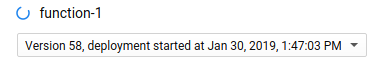</p></details>
        - If the function has been deployed **successfully**, you can continue to the next topic.<details><summary>**Function Deployment Success Image**</summary><p>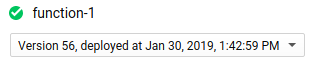</p></details>
        - If the function deployment **fails**, check the **Deployment Failure Log** right below the invocations/second graph, make proper changes in the function and try to deploy it again. <details><summary>**Function Deployment Failure Image**</summary><p>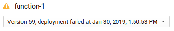</p></details><details><summary>**Deployment Failure Log Image**</summary><p>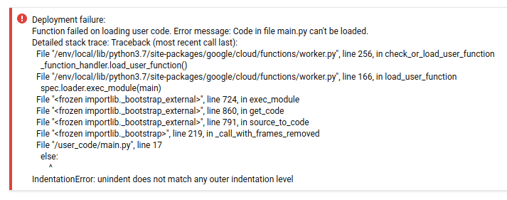</p></details>

2. **Implement The Paho Python Client**

       The Paho Python Client provides a client class with support for both MQTT v3.1 and v3.1.1 on Python 2.7 or 3.x. It also provides some helper functions to make publishing one off messages to an MQTT server very straightforward.

    >**Click [here][12] to access Paho documentation**.

    - Edit the function created in the previous topic or create a new one.
        >**TIP**: Click on the  icon on the top right corner of the **Inline Editor** to expand the code window.
    - Add **paho-mqtt** to the **requirements.txt** tab.<details><summary>**Paho Requirements Image**</summary><p>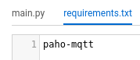</p></details>
    - **DELETE** all content of the **main<span>.py** tab.
    - To import **paho-mqtt**, add the following import to the **main<span>.py** tab:
        ```python
        import paho.mqtt.client as mqtt
        ```
    - To configure the **on_connect** and the **on_message** callbacks, add the following code to the **main<span>.py** tab:
        ```python
        def on_connect(client, data, flags, rc):
            print("Connected!")

        def on_message(client, data, msg):
            print(msg.topic + " " + str(msg.payload))
        ```
    - To return a valid response to DialogFlow, you must implement a **simple_response** function. To do that, add the following import and code to the **main<span>.py** tab:
        ```python
        import json
        ```
        >If your assistant is **not** in **Brazilian Portuguese**, please **REMOVE** the **"lang"** tag of the **JSON** on the **return** statement. There is a bug on DialogFlow that does not recognize responses in Portuguese, so this tag is used to force the response in the desired language.
        ```python
        def simple_response(responses):
            if len(responses) > 2:
                raise Exception(
                    "Responses argument in simple response should have at most two elements only.")
            else:
                responses_json = []
                for response in responses:
                    if response[2]:
                        response_dict = {
                            "displayText": str(response[0]),
                            "ssml": str(response[1])
                        }
                    else:
                        response_dict = {
                            "displayText": str(response[0]),
                            "textToSpeech": str(response[1])
                        }
                    responses_json.append(response_dict)

                return {
                    "lang": "pt-br", # Remove this tag if your assistant is not in Brazilian Portuguese.
                    "payload": {
                        "google": {
                            "expectUserResponse": True,
                            "richInitialPrompt": {
                                "items": [
                                    {
                                        "simpleResponse": responses_json
                                    }
                                ]
                            }
                        }
                    }
                }
        ```
    - To create the **MQTT Client** and associate the callbacks to the created functions, add the following code to a **main** function on the **main<span>.py** tab:
        ```python
        def main(request):
            client = mqtt.Client()
            client.on_connect = on_connect
            client.on_message = on_message
        ```
        >**DO NOT REMOVE** the **request** argument from the **main** function. It is used to handle with the request JSON from DialogFlow.
    - To connect with an **MQTT Broker**, use the same parameters that you used in the **"Test the created Instance"** topic of the **CloudMQTT** section of this document. You can also use another MQTT service of your choice. Add the following code to a **main** function on the **main<span>.py** tab:
        ```python
        client.username_pw_set("INSTANCE_USER", "INSTANCE_PASSWORD")
        client.connect("INSTANCE_SERVER", INSTANCE_PORT, 60) # 60 is the timeout.
        ```
    - To publish a message in a topic, use the following command:
        ```python
        client.publish("topic", "message")
        ```
    - Add the following code in the end of the **main** function to set the simple response and complete the Webhook:
        ```python
        json_resp = simple_response([['Simple Response', 'success', False]])
        return json.dumps(json_resp)
        ```
    - Click on the **OK** button to close the code window expansion.
    - On the **Function to execute** field, change to **main** to execute our main function when this Webhook be triggered.
    - Click on the **Save** button to deploy the function.
    - Wait and check if the edited function has been deployed properly.

3. **Link DialogFlow with Cloud Functions**

    - Open your Agent on [**DialogFlow**][10].
    - In the **lateral menu**, click on the **Fulfillment** option.
    - Enable **Webhook** switcher.
    - Copy the URL from the created function and paste it to the URL field on the Webhook section.<details><summary>Cloud Functions URL Image</summary><p>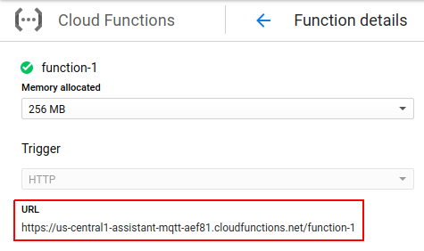</p></details><details><summary>Fulfillment Webhook Image</summary><p>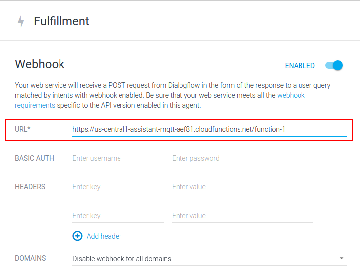</p></details>
    - Click on the **SAVE** button on the bottom of the page.

### **Test the Complete System**

- Repeat the **"Create a Subscriber completing the command"** step in the **"Test the created Instance"** topic of the **"CloudMQTT"** section of this document subscribing to the same topic that you have configured in the **Cloud Functions** code.
- Repeat the **"Test the created Intent"** topic of the **"DialogFlow"** section of this document.
- Check if the **Subscriber** has received the message that you have configured in the **Cloud Functions** code.

[1]:https://console.actions.google.com/
[2]:https://console.developers.google.com/apis/api/embeddedassistant.googleapis.com/overview
[3]:https://console.developers.google.com/apis/credentials/consent
[4]:https://myaccount.google.com/activitycontrols
[5]:https://developers.google.com/assistant/sdk/reference/device-registration/model-and-instance-schemas.html#device_model_json
[6]: https://developers.google.com/actions/localization/languages-locales
[7]:https://www.cloudmqtt.com/
[8]:https://customer.cloudmqtt.com/instance
[9]:https://console.dialogflow.com/api-client/#/newAgent
[10]:https://console.dialogflow.com/api-client
[11]:https://console.cloud.google.com
[12]:https://www.eclipse.org/paho/clients/python/docs/